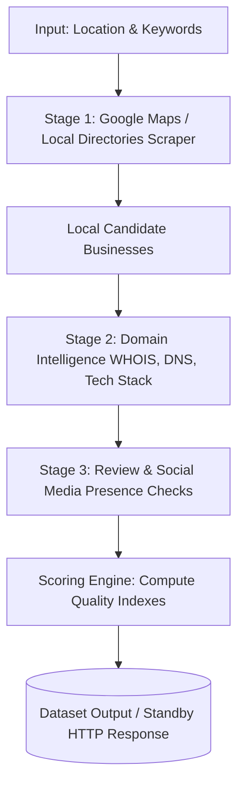

# Local Lead Enrichment Engine – Agency‑Grade Local Lead Scoring API

The **Local Lead Enrichment Engine** is a compound Apify Actor designed to build high-quality, enriched local business lead lists. While traditional Maps/Yelp scrapers only extract basic address and contact information, this Actor performs multi-stage domain and social intelligence checks to qualify and score leads automatically.

---

## 🌟 What Problem It Solves
Most B2B outreach campaigns fail because the lead lists are cold and unqualified. A list of 1,000 businesses scraped from Google Maps might contain invalid websites, dead domains, or businesses with no reviews. 

The **Local Lead Enrichment Engine** enriches these raw lists in real-time, computing:
* **Online Presence Score (0–100):** Strength of their website and social media footprint.
* **Review Health Score (0–100):** Rating distribution and platform diversity.
* **Lead Quality Score (0–100):** A deterministic, B2B-tailored quality index based on tech-stack modernness, domain age, and review health.

This allows agencies, sales teams, and marketers to **target only the high-value prospects** and tailor their pitch based on the prospect's actual tech stack and online visibility gaps.

---

## ⚙️ How It Works (The 3-Stage Pipeline)



### Stage 1: Local Candidate Collection
Queries Google Maps or other local directories using search query strings combined from your `locationQuery` and `industryKeywords`. It compiles names, addresses, ratings, and website URLs.

### Stage 2: Domain Intelligence (B2B Signals)
Extracts the base domain from the business website and performs WHOIS/DNS lookups to find:
* Domain registration dates and registrar details.
* Tech stack profile (WordPress, Shopify, Webflow, Google Analytics, Stripe, HubSpot, etc.).
* DNS record validation (MX, TXT).

### Stage 3: Review & Social Presence Checks
Searches review platforms (Google, Yelp, Facebook) and social networks (LinkedIn, Facebook, Instagram, Twitter) to find contact emails, platform counts, and social profiles.

---

## 🚀 Execution Modes

### 1. Batch Job Mode (Standard Run)
Perfect for building large bulk lists. Configure your inputs in the Apify Console and run. It outputs results to two datasets:
* **`default` (enriched_businesses):** One outreach-ready row per business.
* **`diagnostics`:** A per-business, per-stage log showing which lookups succeeded, skipped, or errored.

### 2. Standby Mode (Realtime HTTP API)
Enables a persistent HTTP server within the Actor to eliminate container start-up latency. You can call the `/enrich-local-leads` endpoint in real-time:
* **Endpoint:** `POST /enrich-local-leads`
* **Port:** Controlled by `ACTOR_WEB_SERVER_PORT` (typically proxied by Apify Console)
* **Response:** Returns JSON containing `enrichedBusinesses` and `diagnostics` directly in the HTTP body.

---

## 📥 Input Specification

Provide the following JSON structure to run the Actor:

```json
{
  "locationQuery": "San Francisco, CA",
  "industryKeywords": [
    "digital marketing agency",
    "dentist"
  ],
  "radiusMeters": 5000,
  "maxBusinesses": 10,
  "minReviewRating": 4.0,
  "minReviewCount": 5,
  "enableDomainIntelligence": true,
  "enableReviewAndSocialChecks": true,
  "googleMapsSourceActorId": "apify/google-maps-scraper",
  "domainIntelActorId": "mock-domain-intel",
  "reviewIntelActorId": "mock-review-intel",
  "proxyConfiguration": {
    "useApifyProxy": true
  }
}
```

---

## 📤 Output Structure (Enriched Business Example)

A single record in the default dataset (`enriched_businesses`):

```json
{
  "business_id": "place_4829103_0",
  "name": "Apex Growth Solutions - San Francisco, CA",
  "formatted_address": "100 Pine St, San Francisco, CA 94111",
  "latitude": 37.7749,
  "longitude": -122.4194,
  "phone": "+1 (415) 555-0110",
  "website": "https://www.apexgrowthsolutions.com",
  "email": "info@apexgrowthsolutions.com",
  "primary_social_profile": "https://www.linkedin.com/company/apexgrowthsolutions",
  "rating": 4.8,
  "review_count": 142,
  "review_platforms": ["google", "yelp", "facebook"],
  "domain": "apexgrowthsolutions.com",
  "registrar": "GoDaddy.com, LLC",
  "domain_age_days": 1825,
  "domain_created_at": "2021-05-28T18:00:00.000Z",
  "dns_records_summary": "A: 192.0.2.85, MX: mail.protection.outlook.com, TXT: v=spf1 include:_spf.google.com ~all",
  "tech_stack": ["WordPress", "Cloudflare", "Google Analytics", "Yoast SEO", "Stripe"],
  "online_presence_score": 100,
  "review_health_score": 98,
  "lead_quality_score": 94,
  "source_actor_run_id": "simulated",
  "enriched_at": "2026-05-27T13:10:00.000Z",
  "location_query": "San Francisco, CA",
  "industry_keywords": ["digital marketing agency"]
}
```

---

## 💡 Best Practices

1. **Scraping Volume & Limits:** Keep `maxBusinesses` under 200 per search to avoid long-running crawls. This Actor focuses on enrichment quality over scraping raw numbers.
2. **Proxy Settings:** Always keep `useApifyProxy` enabled. Domain enrichment and Maps scraping perform a large number of requests that will get blocked without residential proxies.
3. **Standby Mode Usage:** For real-time applications (like website forms or CRM integrations), keep the Actor in Standby Mode. The `/enrich-local-leads` endpoint will reply within seconds using simulated caches when API scrapers take too long.
4. **Legal Compliance:** Comply with the target sites' terms of service, `robots.txt` guidelines, and local regulations (such as GDPR or CAN-SPAM) before initiating cold outreach campaigns using the phone or email addresses fetched.
